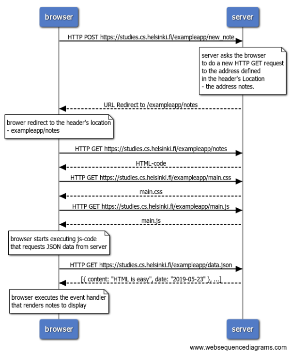

# Part 0 Solutions

## 0.4: new note

### Sequence Diagram:

 

<pre>
<code> 
browser->server: HTTP POST https://studies.cs.helsinki.fi/exampleapp/new_note
note over  server
server asks the browser
to do a new HTTP GET request
to the address defined 
in the header's Location

* the address notes.

end note
server-->browser: URL Redirect to /exampleapp/notes
note over  browser
brower redirect to the header's location

* exampleapp/notes

end note
browser->server: HTTP GET https://studies.cs.helsinki.fi/exampleapp/notes
server-->browser: HTML-code
browser->server: HTTP GET https://studies.cs.helsinki.fi/exampleapp/main.css
server-->browser: main.css
browser->server: HTTP GET https://studies.cs.helsinki.fi/exampleapp/main.js
server-->browser: main.js

note over browser:
browser starts executing js-code
that requests JSON data from server 
end note

browser->server: HTTP GET https://studies.cs.helsinki.fi/exampleapp/data.json
server-->browser: [{ content: "HTML is easy", date: "2019-05-23" }, ...]

note over browser:
browser executes the event handler
that renders notes to display
end note
</code>
</pre>

## 0.5: Single page app

### Sequence Diagram:

 

<pre>
<code> 
browser->server: HTTP GET https://studies.cs.helsinki.fi/exampleapp/spa
server-->browser: HTML-code
browser->server: HTTP GET https://studies.cs.helsinki.fi/exampleapp/main.css
server-->browser: main.css
browser->server: HTTP GET https://studies.cs.helsinki.fi/exampleapp/spa.js
server-->browser: spa.js

note over browser:
browser starts executing js-code
that requests JSON data from server 
end note

browser->server: HTTP GET https://studies.cs.helsinki.fi/exampleapp/data.json
server-->browser: [{ content: "HTML is easy", date: "2019-05-23" }, ...]

note over browser:
browser executes the event handler
that renders notes to display
end note
</code>
</pre>
